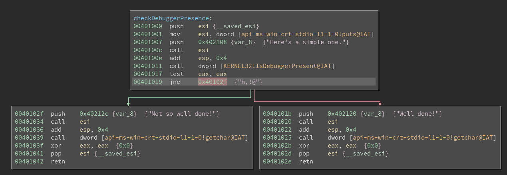

# Crackme1.exe

No further hint given, beside run it in debugger and vm.

## Analyse

```
$ file Crackme1.exe
Crackme1.exe: PE32 executable (console) Intel 80386, for MS Windows

$ binwalk Crackme1.exe

DECIMAL       HEXADECIMAL     DESCRIPTION
--------------------------------------------------------------------------------
0             0x0             Microsoft executable, portable (PE)
7157          0x1BF5          mcrypt 2.5 encrypted data, algorithm: "sProcessorFeaturePresent", keysize: 1069 bytes, mode: "Q",
8288          0x2060          XML document, version: "1.0"
```

So our findings are:

* PE32 -> Windows 32bit
* Intel 80386 -> x86-CPU
* MS Windows -> Windows obv.
* 0x0 File header -> Approves Windows P(ortable) E(xecutable)
* mcrypt 2.5 encrypted data, algorithm: "sProcessorFeaturePresent" -> interesting, maybe we will need that info to solve it later, lets just keep it in mind for now
* XML document -> most likely just some gui or ms bullshit we don't really need right now

Summary:
* Packed Executeable (Windows) 32 Bit (which the CPU format Intel 80386 also inherits)
* sProcessorFeaturePresent

## Run the binary in our victim vm

Output:
```
Here's a simple one.
Well done!
```

As mambda mentioned in the forum thread it's broken, or maybe meant to be opened in the debugger, let's do the for the purpose of education.

Using x32dbg gave us the same output. Huh?

What does the IsProcessorFeturePresent check?
```
PF_FASTFAIL_AVAILABLE 23
_fastfail() is available.
MSDN: Immediately terminates the calling process with minimum overhead

PF_XMMI64_INSTRUCTIONS_AVAILABLE
The SSE2 instruction set is available.
```
fastfail is nothing special at this point and the SSE2 check can be helpful when read the asm code (http://softpixel.com/~cwright/programming/simd/sse2.php)

Well. We know that we know nothing.

Opening Binary Ninja and watch for known stuff I found "IsDebuggerPresent" at crackme1.exe+0x1011
Have a quick look at the xrefs allow's us to see what mambda did there. ;-)



## Possible Solutions

* don't use debugger
* nop IsDebuggerPresent check at 0x1011
* replace jne with jmp and change destination to 101b instead of 102f

Well Done!

## Conclusion

Sometimes looking at the imports is enough to for easy cracking.
