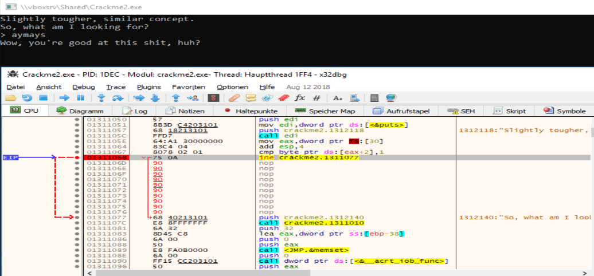

# Crackme2

Same as crackme1, nothing special.

## Investigating the main routine
Opening binary ninja and jumping to the main function at 1040 shows the password already.
004010b5  b861214000         mov     eax, 0x402161  {"aymays"}

## Simple Solution
Open the binary without debugger and enter aymays returns the good boy: "Wow, you're good at this shit, huh?"

## Debugger Solution
Same like Crackme1, when open the binary with debugger a sad smilie appears.
Let's look for this fix also, because we love our debugger, does we?

So here is the jmp which ruins our day:

```
0131105E | 64:A1 30000000           | mov eax,dword ptr fs:[30]               |
...
01311067 | 8078 02 01               | cmp byte ptr ds:[eax+2],1               |
EAX=410000
```

FS = "Flat Segment"
whatever = fs+[0x30]
return of the function we pointing to = [whatever+2]
return == 1 (most likely IsDebuggerPresent == 1)

So what is FS[0x30]?
> FS:[0x30]	GS:[0x60]	NT	Linear address of Process Environment Block (PEB)

A look in the documention for the PEB shows the first field which might be our badboi.
> BeingDebugged:	Whether the process is being debugged	Microsoft recommends not using this field but using the official Win32 CheckRemoteDebuggerPresent() library function instead.[2]

The struct:
```
typedef struct _PEB {
  BYTE                          Reserved1[2];
  BYTE                          BeingDebugged;
  BYTE                          Reserved2[1];
  PVOID                         Reserved3[2];
  PPEB_LDR_DATA                 Ldr;
  PRTL_USER_PROCESS_PARAMETERS  ProcessParameters;
  PVOID                         Reserved4[3];
  PVOID                         AtlThunkSListPtr;
  PVOID                         Reserved5;
  ULONG                         Reserved6;
  PVOID                         Reserved7;
  ULONG                         Reserved8;
  ULONG                         AtlThunkSListPtr32;
  PVOID                         Reserved9[45];
  BYTE                          Reserved10[96];
  PPS_POST_PROCESS_INIT_ROUTINE PostProcessInitRoutine;
  BYTE                          Reserved11[128];
  PVOID                         Reserved12[1];
  ULONG                         SessionId;
} PEB, *PPEB;
```

The first two bytes are reserved and after we can find our BeingDebugged flag.
Remember? +0x2

01311067 | 8078 02 01               | cmp byte ptr _PEB+2,1               |
01311067 | 8078 02 01               | cmp byte ptr _PEB.BeingDebugged,1   |

## Possible debugger solutions

* nop 106d-1072, so we jump but never get ":("
* 0x1068 jne 0x1077 => jmp 0x1077, so we don't care what BeingDebugged contains.


